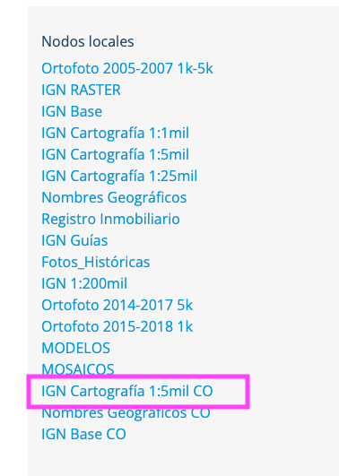
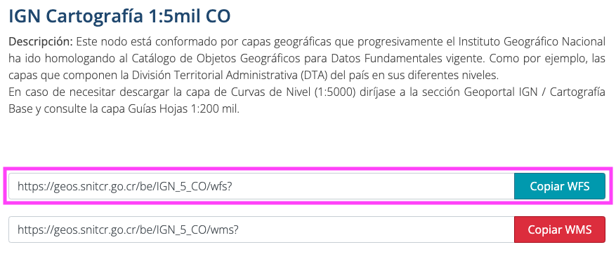
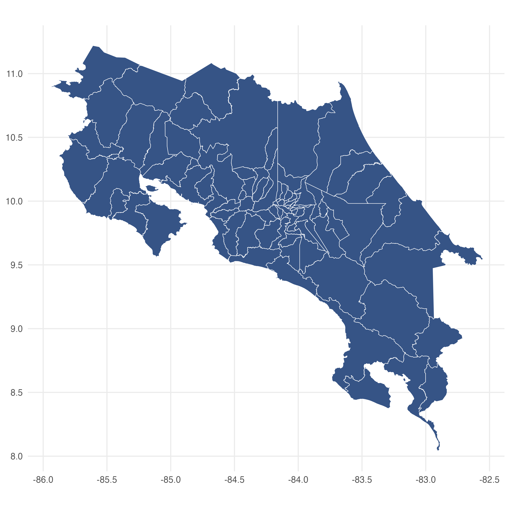

A inicios de 2024 en Costa Rica, se realizaron elecciones municipales. Una vez publicados los resultados, tuve la idea de replicar un gráfico sencillo: un mapa con `ggplot2` de los cantones de Costa Rica, y pintar en colores el partido político que ha ganado en cada una de las regiones. Para ahorrar tiempo hago una búsqueda rápida en google **"shapefile cantones Costa Rica"** al descargar los datos y ejecutar mi código, resulta que me hacen falta cantones. Después de un par de segundos de duda, recordé que en los últimos años se han creado nuevos cantones. Río Cuarto[^rio_cuarto] se separa del cantón de Grecia, Monteverde[^monteverde] de Puntarenas, y uno para mi muy sonado, ya que está muy cerca de donde vivo y conozco muy bien el lugar, Puerto Jiménez[^puerto_jimenez] se separa de Golfito y pasa a ser un cantón.

[^rio_cuarto]: Delfino.cr. (26 de abril de 2018). Expediente 20787: Reforma y Adiciones a la Ley N° 9440, Creación del Cantón XVI Río Cuarto de la Provincia de Alajuela, de 20 de Mayo de 2017. Delfino.cr. [Leer más](https://delfino.cr/asamblea/proyecto/20787)


[^monteverde]: Delfino.cr. (25 de septiembre de 2019). Expediente 21618: Creación del Cantón de Monteverde, Cantón XII de la Provincia de Puntarenas. Delfino.cr. [Leer más](https://delfino.cr/asamblea/proyecto/21618)

[^puerto_jimenez]: Delfino.cr. (21 de octubre de 2021). Expediente 22749: Creación del Cantón de Puerto Jiménez, Cantón XIII de la Provincia de Puntarenas. Delfino.cr. [Leer más](https://delfino.cr/asamblea/proyecto/22749)

Pasa entonces que la fuente de datos para el mapa (shapefile) que tenia guardada está desactualizada. Yo salí de la Universidad en 2016, y fue justo en 2017 que comenzó la aparición de nuevos cantones de forma un poco acelerada.

Si a esto le sumamos que algunos cantones que ya existían antes de 2016 han cambiado de nombre, Alfaro Ruiz ahora es conocido como Zarcero[^zarcero], Valverde Vega se ha transformado en Sarchí[^sarchi], y Aguirre ha pasado a llamarse Quepos[^quepos]. En este punto, algo que creí serían 10 líneas de código, un problema de copiar y pegar, se convertía en algo más interesante. **Así que en esta guia veremos cómo realizar un gráfico actualizado de los cantones de Costa Rica, utilizando como fuente de datos los servicios del [Instituto Geográfico Nacional](https://www.snitcr.go.cr/ign_ign).**

[^sarchi]: Delfino.cr. (11 de febrero de 2015). Expediente 19469: Cambio de Denominación del Cantón XII, Valverde Vega, de la Provincia de Alajuela, para que en Adelante se Denomine Sarchí. Delfino.cr. [Leer más](https://delfino.cr/asamblea/proyecto/19469)

[^quepos]: Presidencia de la República de Costa Rica. (11 de febrero de 2015). Cambio de nombre del Cantón VI de la provincia de Puntarenas para que en adelante se denomine Quepos. Recuperado de [Leer más](https://www.pgrweb.go.cr/scij/Busqueda/Normativa/Normas/nrm_texto_completo.aspx?param1=NRTC&nValor1=1&nValor2=79730&nValor3=100935&strTipM=TC)

[^zarcero]: República de Costa Rica. (16 de junio de 2010). Ley N° 8808: Declara oficial para efectos administrativos, la aprobación de la División Territorial Administrativa de la República N° 41548-MGP [Cambio de nombre del cantón de Alfaro Ruiz a Zarcero]. La Gaceta, N° 116. [Leer más](https://www.pgrweb.go.cr/scij/Busqueda/Normativa/Normas/nrm_texto_completo.aspx?param1=NRTC&nValor1=1&nValor2=88416&nValor3=115607&strTipM=TC)


## Obtener datos actualizados del IGN

### Ante de comenzar

Verifica que tengas instalados los siguientes paquetes:

```{r, message=FALSE}
library(tidyverse)
library(sf)
library(geojsonsf)
library(httr2)
library(ows4R)
library(rmapshaper)
```

::: {.callout-note appearance="simple"}

Si en Windows tienes errores al instalar alguno de los paquetes, quizás falte instalar Rtools. Descárgalo de este [enlace](https://cran.r-project.org/bin/windows/Rtools/) y reinicia antes de intentar de nuevo.
:::

### Descargar datos del IGN

El Instituto Geográfico Nacional es la principal fuente de cartografía en Costa Rica, ofreciendo datos geoespaciales actualizados. Para obtener un shapefile específico para nuestro mapa, recurriremos al servicio WFS en R, enfocándonos en la división cantonal.

+ **Paso 1:** Acceder al IGN

Visita la página de servicios OGC del IGN. En la sección de nodos locales, selecciona el servicio **IGN Cartografía 1:5mil CO.**

{width=30%}

+ **Paso 2:** Identificar la URL del Servicio WFS

A continuación, localizaremos la URL del servicio WFS que utilizaremos, tal como se muestra en la imagen adjunta.

{width=80%}

+ **Paso 3:** Identificar las capas disponibles

Mediante el uso del paquete `ows4R` en R, consultaremos los identificadores de las capas disponibles. Esto nos permitirá seleccionar y descargar la capa adecuada, ya sea a nivel de provincia, cantón o distrito.


```{r, eval=FALSE}
url_wfs <- "https://geos.snitcr.go.cr/be/IGN_5_CO/wfs?"
```


```{r, eval=FALSE}
bwk_client <- WFSClient$new(
  url = url_wfs,
  serviceVersion = "2.0.0"
)

as_tibble(bwk_client$getFeatureTypes(pretty = TRUE))
```

```{r, echo=FALSE}
x <- tribble(
  ~name ,                        ~title    ,                                        
  
  "IGN_5_CO:curvas_5000_2017" ,   "Curvas de nivel cada 10 metros 1:5.000 año 2017",
  "IGN_5_CO:limitedistrital_5k" , "DTA (Límite Distrital)",                           
  "IGN_5_CO:limitecantonal_5k" ,  "Límite Cantonal",                                  
  "IGN_5_CO:limiteprovincial_5k" ,"Límite Provincial"   
)
x
```

::: {.column-margin}
El código para usar servicios WFS proviene del post "Spatial WFS Services" por Thierry Onkelinx, Hans Van Calster, y Floris Vanderhaeghe. [Leer más](https://inbo.github.io/tutorials/tutorials/spatial_wfs_services/)

Nota: Adaptamos funciones para migrar a httr2 desde httr. Consulta [httr2](https://httr2.r-lib.org/articles/httr2.html) para detalles.
:::


+ **Paso 4:** Descargar los datos 

Para descargar los cantones de Costa Rica, utilizaremos la capa denominada **IGN_5_CO:limitecantonal_5k**.

```{r, eval=FALSE}
url <- url_parse(url_wfs)
url$query <- list(
  service = "wfs",
  request = "GetFeature",
  typename = "IGN_5_CO:limitecantonal_5k",
  srsName = "EPSG:4326"
  )
request <- url_build(url)

regiones <- read_sf(request)
st_crs(regiones) <- st_crs(4326)
```

```{r, eval=FALSE}
x <- object.size(regiones)
print(x, units = "auto")
```
```{r, echo=FALSE}
print("20.4 Mb")
```
```{r, eval=FALSE}
ggplot(
  data = regiones
) +
  geom_sf(color = "white", fill = "#365486") +
  theme_minimal()
```




Al haber descargado los datos en el objeto `regiones`, notamos que su tamaño es considerablemente grande. Esto se debe a que, para asegurar una cartografía precisa del país, el IGN emplea una precisión mucho mayor de la necesaria para la mayoría de los mapas que crearemos con ggplot2.

+ **Paso 5:** Simplificar el mapa

Dado que el mapa está formado por polígonos, podemos simplificar estos polígonos eliminando lados. Esto reduce la precisión, pero a la escala de un mapa común creado con `ggplot2`, será imperceptible. Sin embargo, lograremos reducir considerablemente el tamaño del objeto, facilitando el trabajo en equipos con recursos limitados.

```{r, eval=FALSE}
regiones_simplificadas <- ms_simplify(
  input = regiones,
  keep = 0.05,
  keep_shapes = FALSE
)

# eliminar la isla del coco
regiones_simplificadas <- ms_filter_islands(
  input = regiones_simplificadas,
  min_area = 24000000
)

```

```{r, eval=FALSE}
x <- object.size(regiones_simplificadas)
print(x, units = "auto")
```
```{r, echo=FALSE}
print("1.3 Mb")
```


+ **Paso 6:** Guardar los datos localmente

Con los datos ya listos, procederemos a guardarlos localmente. Aunque es posible usar el formato shapefile o GeoJSON, en este caso optaremos por GeoJSON.

::: {.column-margin}
Recomiendo la lectura del post "Limitaciones e inconvenientes del shapefile" [Leer más](https://www.gisandbeers.com/limitaciones-e-inconvenientes-del-shapefile/). ¡Gracias, Roberto, por tu excelente contenido!

:::

```{r, eval=FALSE}
write_sf(regiones_simplificadas, "cantones_cr.geojson")
```


+ **Paso 7:** Leer archivos GeoJSON

Si después de un tiempo deseamos utilizar nuevamente los datos, podemos leerlos fácilmente con la función `st_read()` de la librería `sf`, específica para archivos GeoJSON.

```{r, eval=FALSE}
cantones <- st_read("cantones_cr.geojson", quiet = TRUE)
```


```{r, eval=FALSE}
ggplot(
  data = cantones
) +
  geom_sf(color = "white", fill = "#365486") +
  theme_minimal()
```


## Graficar resultados de las elecciones municipales 2024

## Obeservaciones finales

Hola, soy yo, Carlos, otra vez. Ya terminado este post, me puse a pensar que realmente no tengo ningún criterio formado sobre el tema de los nuevos cantones. ¿Es bueno para la administración del país? Pues no tengo idea. Me dejé a mí mismo de tarea leer más sobre el tema y creo que todos los residentes del país deberíamos tomar un par de minutos para pensarlo.

Laura Fernández Delgado, Ministra de Planificación Nacional y Política Económica, en un oficio a los diputados, dice:

> Preocupa a este ministerio que se esté fraccionando el territorio nacional en
ausencia de estudios y análisis técnicos robustos, y que a la vez no se apliquen
los parámetros contenidos en la Ley sobre División Territorial Administrativa, N°
4366, donde se establece que para la creación de un nuevo cantón se requiere
contar con al menos un 1% de la población nacional.
Las decisiones que tome la Asamblea Legislativa de creación de cantonatos
pueden derivar en problemas de coordinación, de articulación y fragmentación del
territorio; y adicionalmente, en ausencia de estudios técnicos y económicos
pueden repercutir en una afectación a los ciudadanos habitantes de esos
territorios derivada de la incapacidad para la prestación de los servicios públicos
municipales por ausencia de sostenibilidad financiera, entre otros de estos nuevos
cantones. [^mideplan] 

[^mideplan]: San José, 20 de febrero del 2024
MIDEPLAN-DM-OF-0277-2024
A: Directorio Legislativo, Jefaturas de Fracción,
Asamblea Legislativa de Costa Rica
Asunto: Opinión de MIDEPLAN sobre el Primer Debate del Proyecto de Ley N°22.643, “Creación del Cantón Colorado, Cantón Duodécimo de la Provincia de Guanacaste”.
Disponible en: [enlace](https://d1qqtien6gys07.cloudfront.net/wp-content/uploads/2024/02/Dictamen_22643TEXTO-ACTUALIZADO-1.pdf)

Justo en febrero del 2024, días despues de las elecciones municipales se aprobo el Expediente 22643: Creación del Cantón Colorado[^colorado] en Guanacaste y existen 7 proyectos de ley vigentes para crear nuevos cantones.

[^colorado]:Delfino.cr. (19 de febrero de 2024). Expediente 22643: Creación del Cantón Colorado, Cantón Duodécimo de la Provincia de Guanacaste. Delfino.cr. [Leer más](https://delfino.cr/asamblea/proyecto/22643)

1. Expediente 24.062: Creación del Cantón de Cervantes, Cantón IX de la Provincia de Cartago.

2. Expediente 23.406: Creación del Cantón XVII de la Provincia de Alajuela, Peñas Blancas.

3. Expediente 23.403: Creación del Cantón Jicaral, Cantón XIV de la Provincia de Puntarenas.

4. Expediente 23.109: Creación del Cantón Cóbano.

5. Expediente 23.055: Creación del Cantón de Paquera, Cantón XIV de la Provincia de Puntarenas.

6. Expediente 22.874: Creación del Cantón Ojo de Agua, Cantón XVII de la Provincia de Alajuela.

7. Expediente 24.153: Creación del Cantón XVII, Provincia de Alajuela, Ojo de Agua.


Así que menos mal que ya sabemos cómo tener el mapa actualizado, porque si por la fecha se saca el día, lo vamos a tener que hacer con frecuencia en los próximos años.