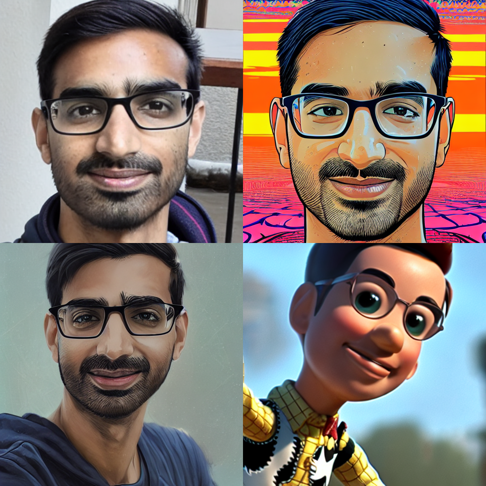

I'm super impressed with the quality of Dreambooth using [HuggingFace Diffusers](https://huggingface.co/docs/diffusers/training/dreambooth) 🚀 --- with only 14 images of myself! These four images are created by Stable Diffusion using the same fine-tuned model with different prompts:[^prompts]

[^prompts]:

    Here are the exact prompts I used for each of the above images:

    - **Top-left:** a photo of \<dreambooth token\>
    - **Top-right:** Hypnotic illustration of \<dreambooth token\>, hypnotic psychedelic art by Dan Mumford, pop surrealism, dark glow neon paint, mystical, Behance ([PublicPrompts source](https://publicprompts.art/psychedelic-pop-art/))
    -  **Bottom-left:** Hypnotic illustration of \<dreambooth token\>, anime illustration by makoto shinkai, stanley artgerm lau, wlop, rossdraws, concept art, digital painting ([PublicPrompts source](https://publicprompts.art/hyper-realistic-anime-portraits/))
    -  **Bottom-right:** Toy Story's Woody as \<dreambooth token\>, 4k, artstation, cgsociety, award-winning, masterpiece, stunning, beautiful, glorious, powerful, fantasy art by Greg Rutkowski, octane render, unreal engine, high ([Lexica source](https://lexica.art/prompt/6c0dd61e-3d90-49ac-b32f-07f19b1a7d84))

{width=600px fig-align=center}